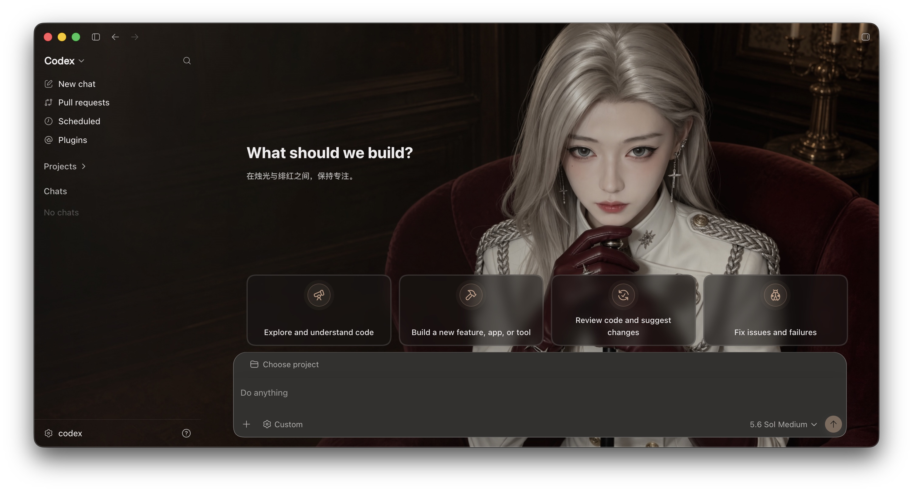
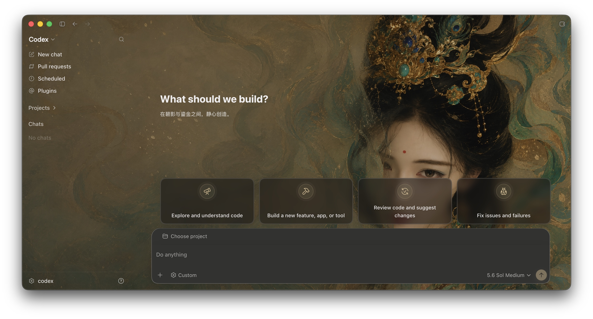
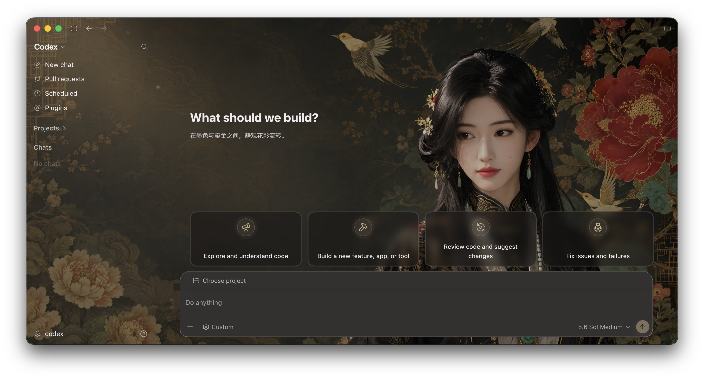
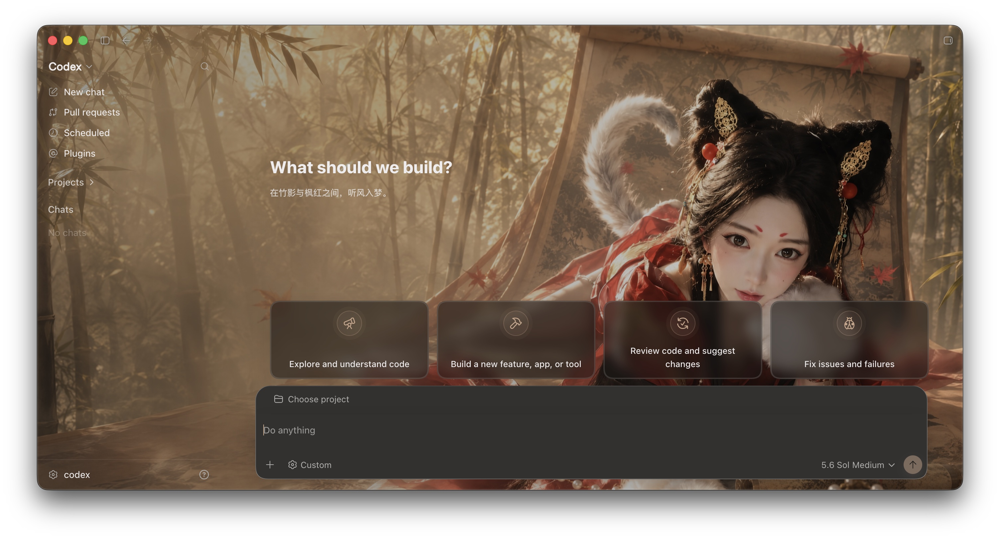
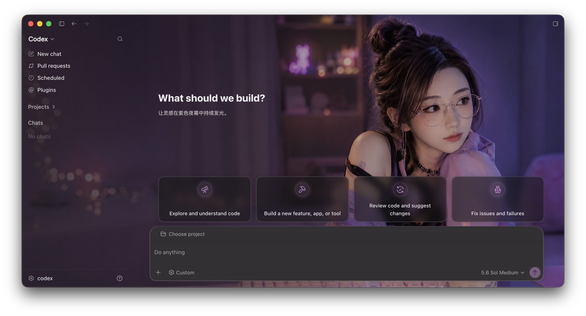
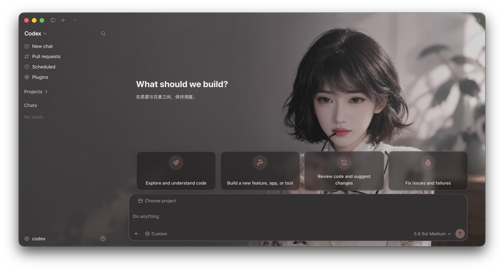
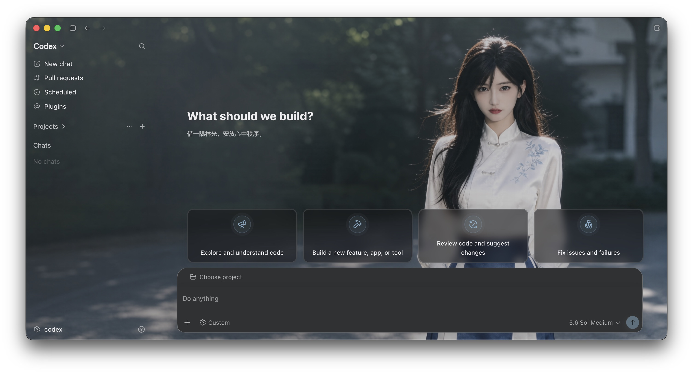
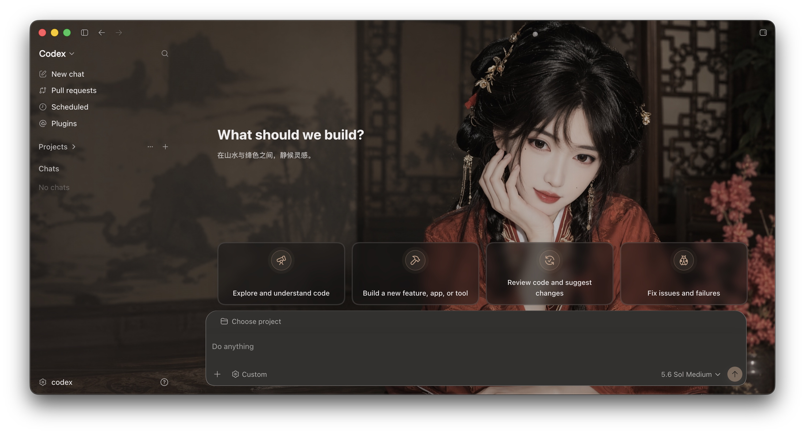

# Codex Dream Skin Themes

用于保存和分享 Codex Dream Skin macOS 主题包的独立仓库。

换肤引擎来自 [`Fei-Away/Codex-Dream-Skin`](https://github.com/Fei-Away/Codex-Dream-Skin)；本仓库只保存主题素材和安装脚本。

## 当前主题

| 主题 | ID |
| --- | --- |
| 绯红银誓 | `preset-crimson-silver` |
| 碧落金阙 | `preset-jade-golden-palace` |
| 鎏金花影 | `preset-golden-peony` |
| 枫影绯狐 | `preset-autumn-fox` |
| 紫夜霓光 | `preset-violet-night` |
| 雾光花影 | `preset-misty-bloom` |
| 青黛林间 | `preset-indigo-grove` |
| 绛影山居 | `preset-vermilion-retreat` |

## 效果预览

以下截图展示各主题在 Codex macOS 客户端中的实际效果。点击图片可查看大图。

<table>
  <tr>
    <td align="center"><strong>绯红银誓</strong><br><a href="./docs/screenshots/crimson-silver.jpg"></a></td>
    <td align="center"><strong>碧落金阙</strong><br><a href="./docs/screenshots/jade-golden-palace.jpg"></a></td>
  </tr>
  <tr>
    <td align="center"><strong>鎏金花影</strong><br><a href="./docs/screenshots/golden-peony.jpg"></a></td>
    <td align="center"><strong>枫影绯狐</strong><br><a href="./docs/screenshots/autumn-fox.jpg"></a></td>
  </tr>
  <tr>
    <td align="center"><strong>紫夜霓光</strong><br><a href="./docs/screenshots/violet-night.jpg"></a></td>
    <td align="center"><strong>雾光花影</strong><br><a href="./docs/screenshots/misty-bloom.jpg"></a></td>
  </tr>
  <tr>
    <td align="center"><strong>青黛林间</strong><br><a href="./docs/screenshots/indigo-grove.jpg"></a></td>
    <td align="center"><strong>绛影山居</strong><br><a href="./docs/screenshots/vermilion-retreat.jpg"></a></td>
  </tr>
</table>

## 安装

先启动过一次官方 Codex，然后退出 Codex。若尚未安装引擎：

```bash
git clone https://github.com/Fei-Away/Codex-Dream-Skin.git
cd Codex-Dream-Skin/macos
./scripts/install-dream-skin-macos.sh --no-launch
```

再安装本主题仓库：

```bash
git clone https://github.com/aaronfang/codex-dream-skin-themes.git
cd codex-dream-skin-themes
./scripts/install-themes-macos.sh --id preset-crimson-silver
```

主题会复制到：

```text
~/Library/Application Support/CodexDreamSkinStudio/themes/
```

只安装、不立即应用：

```bash
./scripts/install-themes-macos.sh --no-apply
```

之后请使用桌面的 `Codex Dream Skin.command` 启动 Codex。直接双击 `/Applications/ChatGPT.app` 不会打开主题所需的本机 CDP 调试会话。

## 切换主题

```bash
ENGINE="$HOME/.codex/codex-dream-skin-studio/scripts"
"$ENGINE/switch-theme-macos.sh" --id preset-crimson-silver
```

安装 SwiftBar 后，也可以从右上角 `🎨 Skin → 已保存的主题` 切换。安装入口来自引擎仓库：

```bash
cd /path/to/Codex-Dream-Skin/macos
./Install\ Menu\ Bar.command
```

## SwiftBar 安装与配置

SwiftBar 是 macOS 菜单栏控制面板，不负责生成主题素材；它只负责启动、暂停、重新应用和切换已保存主题。

### 1. 安装 SwiftBar

如果还没有安装：

```bash
brew install --cask swiftbar
```

首次打开 SwiftBar 时，如果它询问插件目录，可以先取消，下一步脚本会自动配置正确目录。

### 2. 注册 Codex Dream Skin 插件

在本主题仓库目录执行：

```bash
./scripts/install-swiftbar-macos.sh
```

这个脚本要求已经安装原始 Codex Dream Skin 引擎，并会调用引擎自带的插件安装逻辑。它不会重复安装 SwiftBar。

插件目录是：

```text
~/Library/Application Support/CodexDreamSkinStudio/menubar
```

插件文件是：

```text
codex_dream_skin.10s.sh
```

`.10s.sh` 表示 SwiftBar 默认每 10 秒刷新一次状态。

### 3. 确认菜单栏

完成后，macOS 右上角应出现：

```text
🎨 Skin
```

菜单中可以使用：

- `应用皮肤`：启动 Codex 并应用当前主题；
- `重新应用皮肤`：Codex 已运行时热加载主题；
- `暂停皮肤`：暂时移除注入效果；
- `换一张图…`：导入新的纯背景并生成自定义主题；
- `已保存的主题`：在主题之间切换；
- `打开图片文件夹`：打开本地图片归档目录；
- `完全恢复`：停止注入并恢复官方外观；
- `刷新`：立即刷新菜单状态。

### 4. 菜单栏没有显示时

打开 SwiftBar → Preferences，确认 Plugin Folder 设置为：

```text
/Users/你的用户名/Library/Application Support/CodexDreamSkinStudio/menubar
```

也可以重新执行：

```bash
./scripts/install-swiftbar-macos.sh
```

如果 SwiftBar 正在运行，退出并重新打开 SwiftBar，或在菜单中执行 Refresh All。

### 5. 更新引擎或主题后重新注册

原始引擎更新后，重新执行以下命令即可同步插件脚本：

```bash
./scripts/install-swiftbar-macos.sh
```

它只会更新插件和引擎脚本副本，不会删除已保存主题。

## 更新

```bash
cd /path/to/codex-dream-skin-themes
git pull
./scripts/install-themes-macos.sh --id preset-crimson-silver
```

## 新增主题

新增一个目录：

```text
themes/preset-my-theme/
├── background.jpg
└── theme.json
```

主题要求：

- 目录名和 `theme.json.id` 使用 `preset-<slug>`；
- 背景为无 UI 的纯图片，推荐 `2560×1440`、16:9；
- 不超过 16 MB，宽高不超过 16384 像素，总像素不超过 5000 万；
- 左侧约 50%–58% 低信息、低对比，主体放在右侧；
- `theme.json.image` 只能是本目录内的文件名；
- 不要把 Codex 截图、窗口、按钮、文字、Logo 或水印放入背景。

新增后提交：

```bash
git add themes/preset-my-theme
git commit -m "feat: add my theme"
git push
```

安装脚本会自动安装仓库中的全部 `preset-*` 主题，且不会删除用户已有的 `custom-*` 主题。

## Windows 安装

Windows 使用原始项目的系统托盘引擎。要求：

- Microsoft Store 安装的官方 `OpenAI.Codex` 应用；
- Node.js 22 或更高版本，并且 `node.exe` 在 `PATH` 中；
- Windows PowerShell 5.1 或更高版本。

先关闭 Codex，然后安装引擎：

```powershell
git clone https://github.com/Fei-Away/Codex-Dream-Skin.git
Set-Location .\Codex-Dream-Skin\windows
powershell.exe -NoProfile -ExecutionPolicy Bypass -File .\scripts\install-dream-skin.ps1
```

安装完成后会创建：

- `Codex Dream Skin`：启动并应用皮肤；
- `Codex Dream Skin - Tray`：打开系统托盘菜单；
- `Codex Dream Skin - Restore`：恢复官方外观。

然后下载本主题仓库：

```powershell
git clone https://github.com/aaronfang/codex-dream-skin-themes.git
Set-Location .\codex-dream-skin-themes
```

将仓库中的主题包复制到 Windows 主题库：

```powershell
$stateRoot = Join-Path $env:LOCALAPPDATA 'CodexDreamSkin'
$themesRoot = Join-Path $stateRoot 'themes'
$source = Join-Path (Get-Location) 'themes\preset-crimson-silver'
$destination = Join-Path $themesRoot 'preset-crimson-silver'

New-Item -ItemType Directory -Force -Path $themesRoot | Out-Null
Remove-Item -LiteralPath $destination -Recurse -Force -ErrorAction SilentlyContinue
Copy-Item -LiteralPath $source -Destination $destination -Recurse -Force
```

打开 `Codex Dream Skin - Tray`，选择：

```text
已保存主题 → 绯红银誓
```

Windows 端的主题库位置是：

```text
%LOCALAPPDATA%\CodexDreamSkin\themes
```

### Windows 更新主题

```powershell
Set-Location .\codex-dream-skin-themes
git pull

$stateRoot = Join-Path $env:LOCALAPPDATA 'CodexDreamSkin'
$destination = Join-Path $stateRoot 'themes\preset-crimson-silver'
Remove-Item -LiteralPath $destination -Recurse -Force -ErrorAction SilentlyContinue
Copy-Item -LiteralPath '.\themes\preset-crimson-silver' -Destination $destination -Recurse -Force
```

回到托盘的“已保存主题”中重新点击“绯红银誓”即可。新增主题时，把对应的 `preset-*` 目录复制到同一个 `themes` 文件夹，托盘会自动列出它。

Windows 主题注入仍然只使用本机回环 CDP，不会修改 WindowsApps、`app.asar` 或官方应用签名。

## 素材权利

安装脚本按 MIT License 发布；主题背景图不自动获得软件许可证授权。公开分享前，请确认生图工具的输出许可、肖像权、版权、商标权、角色权和再分发权限。当前主题背景是外部工具生成的用户素材，详见 [`ARTWORK-NOTICE.md`](./ARTWORK-NOTICE.md)。
